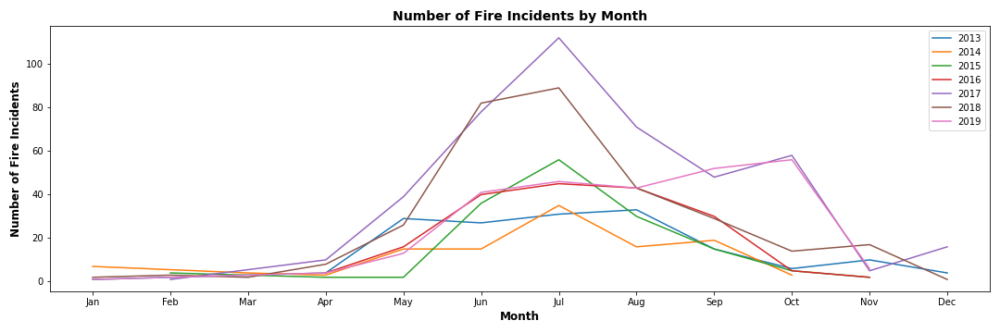
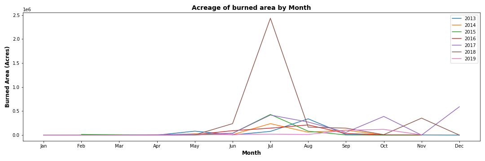

# Pyres of California

## Background

Our project is to evaluate and analyze California Wildfire Data based on a California Wildfire Incidents dataset between 2013 and 2019. The project will focus on factors such as resources deployed, acreage burned, structure damage, injuries, personnel involved in firefighting and related questions, as the data admits.

## Assumption

- [California wildfire incidents from 2013 to 2019]('Resources/California_Fire_Incidents_original.csv') and [list of California county]('Resources/ca_county_list.csv') will be applied in order to conduct the analysis.
- The analysis will be divided into 2 main parts, all fire incidents and major fire incidents (based on dataset).
- In each main part, the analysis will focus on resources and the damage of fire by County. 
- Personnel invloved will represent all the resources in this analysis.

## Hypothesis

- Fire incident has a time pattern of occurrence
- Burned time has relation with burned area.
- Larger area of burn or longer fire duration requires more resources
- Higher number of fire incidents lead to higher number of injuries

## Data Limitation

- Data incompletion which will be excluded might cause an inaccurate conclusion.
- The definition of major fire incident in the dataset which indicates by true/false differs from California Fire Department which states that major fire incident is more than 10 arces. The group decision was using the information based on the dataset because we counldn't find the evidence to support if the file is uncredible.

## Analysis

### Statistical Summary

Overall statistics performed for the overall data set were calculated for various critical parameters, including acres burned, injuries, equipment used, personnel involved, and structures damaged and destroyed, etc. As presented in the table, there is a wide range of values for each parameter, as reflected by the differential variance and standard deviation. Also, the histogram graph shows that the dataset is a random distribution.

**Statistical Table** | **Histogram Graph**
--------------------- | ---------------------
 | 

### California Fire Summary

**By Year and Month**

***Are there any trends in the time of year that fires are most active? Which year was the most active?***

When examining the number of fire incidents by month, for both the number of incidents and acres burned, there’s an increase for the month of July, across years 2013-2019. The year 2017 had the greatest number of fires, 438 times. The year 2018 had the greatest amount of area burned, 1,549,401 acres.

**By County**

***Which California counties had the highest number of fires? Are there any counties that were untouched by wildfires?***

- Out of all 58 counties in California, Riverside County had the highest number of fire incidents: 146 times. Whereas, San Francisco County and Imperial County both had zero fire incidents between 2013-2019.

- When studying only major fire incidents, another small county, Alpine County, joins the two counties mentioned above as counties that had no major fires between 2013 and 2019.

