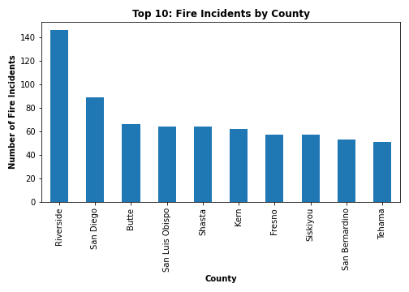
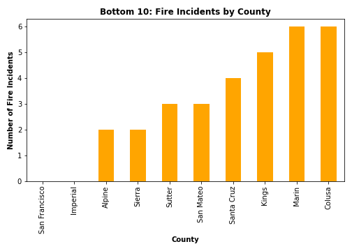
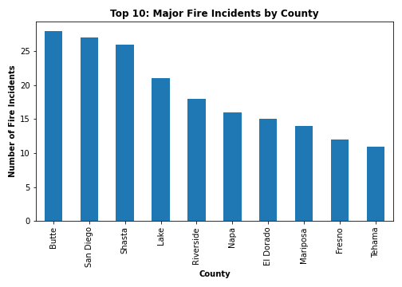
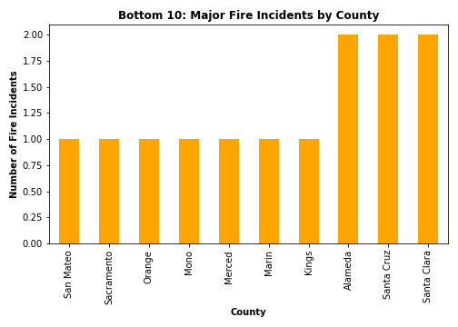
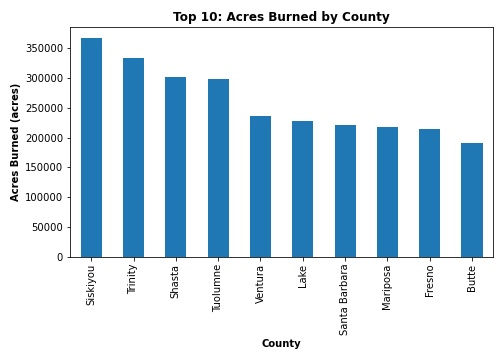
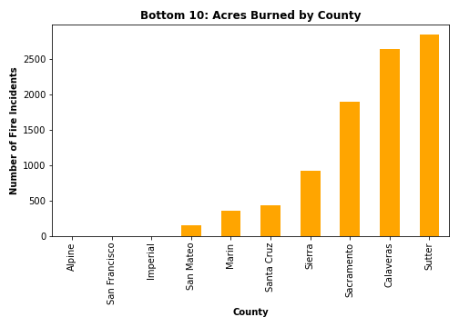

# Pyres of California

## Background

Our project is to evaluate and analyze California Wildfire Data based on a California Wildfire Incidents dataset between 2013 and 2019. The project will focus on factors such as resources deployed, acreage burned, structure damage, injuries, personnel involved in firefighting and related questions, as the data admits.

## Assumption

- [California wildfire incidents from 2013 to 2019]('Resources/California_Fire_Incidents_original.csv') and [list of California county]('Resources/ca_county_list.csv') will be applied in order to conduct the analysis.
- The analysis will be divided into 2 main parts, all fire incidents and major fire incidents (based on dataset).
- In each main part, the analysis will focus on resources and the damage of fire by County. 
- Personnel invloved will represent all the resources in this analysis.

## Hypothesis

- Fire incident has a time pattern of occurrence
- Burned time has relation with burned area.
- Larger area of burn or longer fire duration requires more resources
- Higher number of fire incidents lead to higher number of injuries

## Data Limitation

- Data incompletion which will be excluded might cause an inaccurate conclusion.
- The definition of major fire incident in the dataset which indicates by true/false differs from California Fire Department which states that major fire incident is more than 10 arces. The group decision was using the information based on the dataset because we counldn't find the evidence to support if the file is uncredible.
- When applying correlation calculation method to the entire dataset, it shows that the dataset have a strong correlation among variabilities. However, the amount of data that generate the strong correlation is dramatically low.     

## Analysis

### Statistical Summary

Overall statistics performed for the overall data set were calculated for various critical parameters, including acres burned, injuries, equipment used, personnel involved, and structures damaged and destroyed, etc. As presented in the table, there is a wide range of values for each parameter, as reflected by the differential variance and standard deviation. Also, the histogram graph shows that the dataset is a random distribution.

**Statistical Table** | **Histogram Graph**
--------------------- | ---------------------
 | 

### California Fire Summary By Year and Month

***Are there any trends in the time of year that fires are most active? Which year was the most active?***

When examining the number of fire incidents by month, for both the number of incidents and acres burned, there’s an increase for the month of July, across years 2013-2019. The year 2017 had the greatest number of fires, 438 times. The year 2018 had the greatest amount of area burned, 1,549,401 acres.

### California Fire Summary By County

***Which California counties had the highest number of fires? Are there any counties that were untouched by wildfires?***

- Out of all 58 counties in California, Riverside County had the highest number of fire incidents: 146 times. Whereas, San Francisco County and Imperial County both had zero fire incidents between 2013-2019.

**Top 10 Counties** | **Bottom 10 Counties**
--------------------- | ---------------------
 | 

- When studying only major fire incidents, another small county, Alpine County, joins the two counties mentioned above as counties that had no major fires between 2013 and 2019.

**Major Top 10 Counties** | **Major Bottom 10 Counties**
--------------------- | ---------------------
 | 

---
***Which county ranked the highest in terms of area burned? Which county ranked the lowest in area burned?***

- Out of all the counties that had at least one fire incident reported between 2013-2019, Siskiyou county has the highest area burned: 367,914 acres. Whereas, San Mateo county has the lowest area burned at only 153 acres.

**Top 10 Counties: Area** | **Bottom 10 Counties: Area**
--------------------- | ---------------------
 | 

- 40 percent of all counties in California (22 counties) have lost at least 100,000 acres due to fires between 2013-2019. 

---
### California Fire Factor (Duration of Fire)

***What is the correlation between the time a fire incident has burned versus the size of the area burned?***

- The correlation between the size of the area burned versus the duration of time the fire burned is 0.0576, which implies that there is no relation between these factors. 

  

- The correlation between the size of the area burned versus the frequency in each county is 0.413, which implies that there is moderate relation between fire frequency and burned area.

  

---
### California Fire-Fighting Resources Deployed

***How do counties compare when measuring the severity of wildfire events, loss of life, and fire-fighting equipment deployed?***

- As seen in the figure below, Butte County had considerability higher loss of life due to wildfires than any other counties in this dataset. 

- Additional research attributed Butte County’s staggering loss of life to the 2018 Camp Fire. To date, the Camp Fire remains the deadliest and most destructive wildfire in California’s history. 

- This discovery could also be seen in the data that showed a spike in the equipment used in 2018.

  

---
- When comparing equipment deployed for fighting wildfires from 2013-2019, Butte County and San Diego County had similar figures, despite Butte County suffering a much higher loss of life. 

  

---
***How are fire-fighting resources and personnel dispatched to fire incidents over the period between 2013-2019 and is there a difference between major and minor incidents?***

- Two different measures were used to study resource allocation by year: 
* 1) How many individual major fire incidents per year had resources allocated to combat them?
* 2) How many resources in total were dispatched to fight major incident fires per year? 
* In the first figure below, 2015 had the highest number of major incident fires that had resources dispatched to fight the fires while 2018 had the lowest number. However, in the second figure below, 2018 had the highest total usage of fire-fighting resources. This suggests that one or a few major incident fires in 2018 received far more resources than all previous fires from the 2013-2019 dataset.

- There is a noticeable difference in how all fire-fighting resources were allocated to fight fires from 2013-2018 with a shift occurring in 2019. Previously, fire-fighting equipment and personnel were only sent to major fire incidents, but beginning in 2019, resources and personnel were also sent to minor fires.

  

  

---
***What is the correlation between the number of injuries reported and the number of crews involved in fighting wildfires?***

- A Pearson correlation of 0.7 was observed between injuries and crews, suggesting a relatively strong trend between these two parameters. As shown in the figure below, the trendline equation reflects the estimated number of injuries that may occur based on the size of the crew employed. This correlation may be helpful in forecasting future injuries based on the number of crews involved and deploy sufficient resources (hospitals, etc.). A similar result was obtained between “Injuries” and “Personnel Involved”.

  

  

---
***What is the correlation between the number of fire incidents and the number of personnel involved in fighting wildfires?***

*Assumption:*

*Correlation between Personnel Involved and Air Tankers, Crews, Dozers, Engines, Helicopters, Water Tender are close to 1 which means there is a strong relation among those variable. Therefore, the study will use Personnel Involved represents all others equipment to find the relation between number of fire incidents and resources.*

  

- The correlation between personnel involved versus the number of fire incidents the fire burned is 0.71, which implies that there is a strong relation between these factors. In other words, the higher number of fires requires more resources to prevent the larger fire damage.

  

### What will look like in the world map?

**All California Fire Incident**

  

*Note:* The red circle represents fire incidents between 2013 - 2019. The size of circle represents the acreage of burn.

**Counties that have zero fire incident**

  

---
## Futher Analysis

- Including meteorological factors from OpenWeather API; temperature, wind speed and humidity, into analysis to discover the correlation of these factors and the fire occurrence.

- Compared to the county that has no fire incident and county that has the highest number of fire incidents and acreage of burned area.

- The relationship between acreage burned by county and county size (both area and population). The county size was not available in the dataset utilized for our project and would need to be imported from other sources. However, leveraging this information in conjunction with this dataset would likely reveal more thought-provoking trends about California wildfires and successful fire-fighting tactics.

-  The year 2018 for the Camp Fire event, plus the Mendocino Complex Fire, which also occurred in 2018 and was until recently the largest wildfire in CA history. Focusing on the data of these events, including the equipment used, the personnel involved, and add API calls to Open Weather for the weather surrounding these events as well historical weather data for the counties involved.

---
## Contributor

[Alessandro Travaglia](https://github.com/atravaglia) : atravaglia@gmail.com

[Atcharaporn Puccini](https://github.com/abpuccini): b.atcharaporn@gmail.com

[Juliann Pezzullo](https://github.com/jump8621): jump8621@gmail.com

[Lee Prout](https://github.com/LeeProut): wleeprout@gmail.com

[Lydia Field](https://github.com/lydiapf): lydia291@gmail.com

UNC Boot Camp 2020
